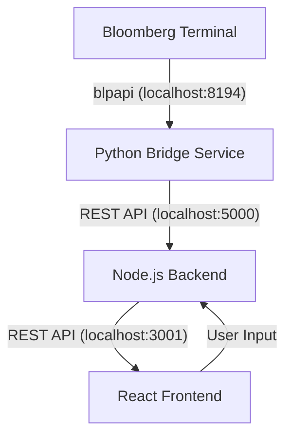

# Credit Rating Alert Dashboard - Technical Handover Manual

This document provides a comprehensive, step-by-step guide for developers taking over the Credit Rating Alert Dashboard. It covers the architecture, setup process for Bloomberg Terminal integration, and troubleshooting common data issues.

## 1. Project Overview & Architecture

The dashboard provides real-time monitoring of credit ratings across Moody's, S&P, and Fitch. It uses a **Bridge Architecture** to solve compatibility issues between modern web stacks and the Bloomberg Terminal's legacy API.

### 🧩 Architecture Diagram


- **Python Bridge (Flask)**: Handles the heavy lifting of connecting to the Bloomberg `blpapi`. It manages bond screening, batching, and data normalization.
- **Node.js Backend (Express)**: Manages data filtering, caching, and serving the React frontend.
- **Frontend (React)**: Professional Bloomberg-style UI with frozen columns and conditional color coding.

---

## 2. System Prerequisites

> [!IMPORTANT]
> **Windows OS is Required**: The Bloomberg Terminal and its Desktop API (DAPI) only run on Windows.

### Hardware-Specific Requirements
- **ARM64 Machines (e.g., Surface Pro, Parallels)**: You **must** install a separate x64 version of Python to be compatible with the Bloomberg Terminal's x64 binaries.
- **Standard x64 Machines**: Standard Python 3.8+ is sufficient.

### Software Required
- **Bloomberg Terminal**: Installed and logged in.
- **Node.js**: 16.0 or higher.
- **Python**: 3.12 (specifically the **x64 version** if on an ARM machine).

---

## 3. Step-by-Step Handover Guide

Follow these steps exactly to ensure the Bloomberg integration works correctly.

### Step 3.1: Python Environment Setup
1. **Install Python 3.12 (x64)**:
   - If on ARM64, download the `Windows installer (64-bit)` from [python.org](https://www.python.org/downloads/windows/).
   - Install it to a specific path like `C:\Python312-x64`.
2. **Verify Python Architecture**:
   ```powershell
   & "C:\Python312-x64\python.exe" -c "import platform; print(platform.architecture())"
   # Should output: ('64bit', 'WindowsPE')
   ```

### Step 3.2: Manual Bloomberg SDK Installation
The Bloomberg SDK (`blpapi`) cannot be installed via a simple `pip install`. You must download the binary:
1. Go to [Bloomberg API Library](https://www.bloomberg.com/professional/support/api-library/).
2. Look for **Desktop API** -> **Python**.
3. Download the `.whl` (wheel) file that matches your Python version (e.g., `blpapi-xxx-cp312-cp312-win_amd64.whl`).
4. Install it manually:
   ```powershell
   & "C:\Python312-x64\python.exe" -m pip install "C:\path\to\downloaded\blpapi.whl"
   ```

### Step 3.3: Service Configuration (`.env`)
You need two environment files:
1. **Python Service**: Create `backend/bloomberg-python-service/.env`
   ```env
   BLOOMBERG_HOST=localhost
   BLOOMBERG_PORT=8194
   FLASK_PORT=5000
   ```
2. **Main Application**: Create `.env` in the root folder
   ```env
   PYTHON_SERVICE_URL=http://localhost:5000
   ```

---

## 4. Running the Stack (3-Terminal Workflow)

To run the application, you must keep three terminal windows open:

### Terminal 1: Python Bridge
```powershell
cd backend/bloomberg-python-service
& "C:\Python312-x64\python.exe" bloomberg_api.py
```
*Wait for: `✅ Connected to Bloomberg Terminal at localhost:8194`*

### Terminal 2: Node.js Backend
```powershell
cd backend
npm install
npm run dev
```
*Wait for: `📊 Bloomberg Terminal connected via Python service`*

### Terminal 3: React Frontend
```powershell
npm install
npm run dev
```
*Open: http://localhost:5173*

---

## 5. Technical Implementation Details

### 🔍 Bond Screening Strategy
The code tries multiple indices to maximize data retrieval across different user permission sets. It tries them in this order:
1. `LEGATRUU Index` (Bloomberg Global Agg USD)
2. `LUACTRUU Index` (US Corporate)
3. `LF98TRUU Index` (US High Yield)
4. `LBUSTRUU Index` (US Aggregate)

### 🏷️ Data Identity (The "Unknown Issuer" Fix)
Bloomberg requires specific formatting for security identifiers. The service automatically appends the "Yellow Key" suffix:
- Raw ISIN: `US912828Z250` -> Becomes: `US912828Z250 Corp`
Without the `Corp` suffix, the API will return empty "Unknown Issuer" fields.

### 💨 Performance (Batching)
Fetching data for 3,000 bonds at once causes time-outs and 503 errors. The Python service implements **Batching**:
- It splits the 3,000 security identifiers into groups of **100**.
- It fetches reference data sequentially for each batch.
- This ensures high reliability and avoids overloading the Terminal's request buffer.

---

## 6. Troubleshooting & Data Limits

### 🔴 Error -4001: Daily Capacity Reached
If you see the message **"Bloomberg Daily Data Limit Reached"**:
- **Cause**: The Bloomberg Terminal has a fixed daily quota for data points (DAPI limit). Fetching ~3,000 full records multiple times in one day can saturate this.
- **Solution**: The limit resets daily (usually at midnight). During the lockout, the dashboard will show an explicit error message instead of fake data.

### 🔴 503 Service Unavailable / "Failed to screen bonds"
- **Check Terminal Status**: Ensure the Terminal is logged in. If it's locked or at the "Login" screen, the API won't work.
- **Diagnostic Command**: You can test the Python service independently:
  ```powershell
  curl http://localhost:5000/api/bonds?limit=10
  ```

---

## 7. How to Maintain & Extend

### Adding New Bloomberg Fields
1. Add the field name (e.g., `PX_LAST`) to the `fields` list in `bloomberg_api.py`.
2. Update the `transform_bloomberg_data` mapping function in `bloomberg_api.py`.
3. Update the TypeScript `Issuer` interface in `backend/src/models/data-models.ts`.

### Changing the Monitoring Index
Modify the `indices` list in the `screen_usd_bonds` function in `bloomberg_api.py`.

---

**Handover Status**: All code has been moved to "Strict Mode" (no demo data). Any issues with data display are now directly related to Bloomberg Terminal connection or permissions, which will be reported via explicit error banners in the UI.
